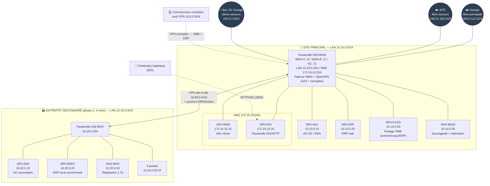
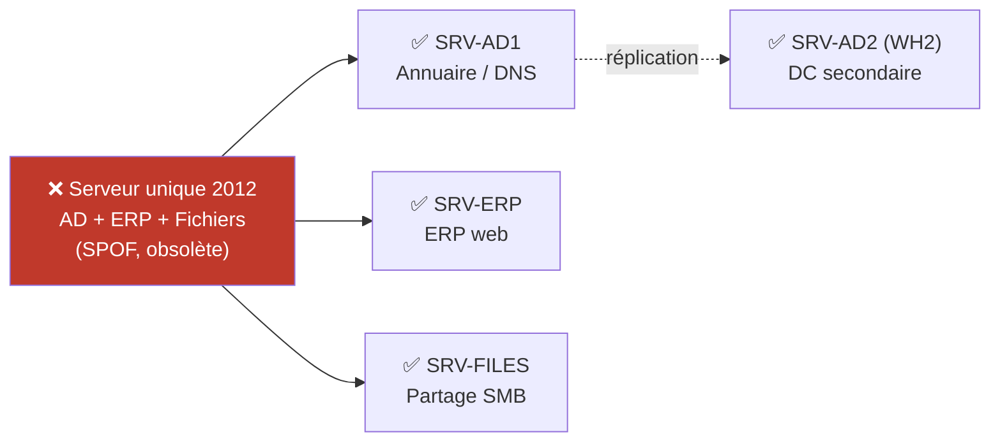
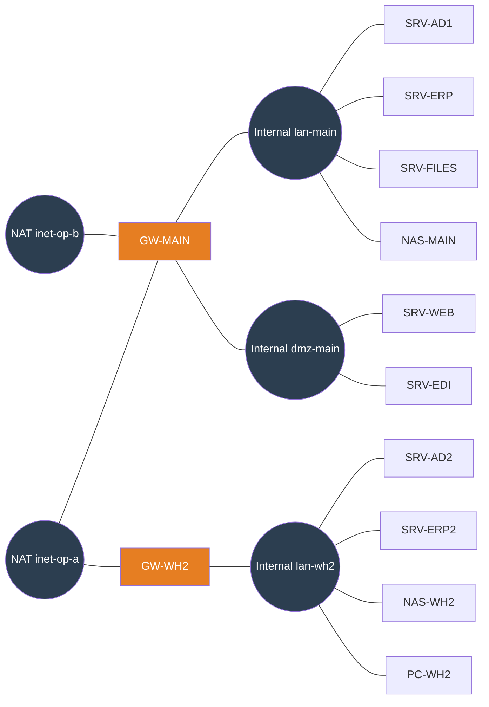
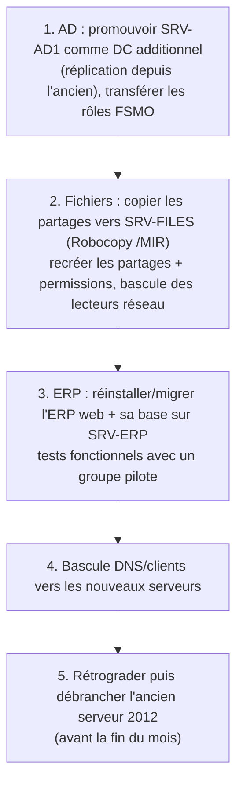
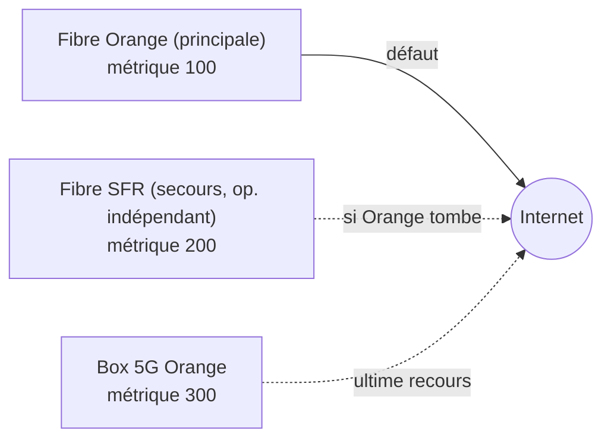
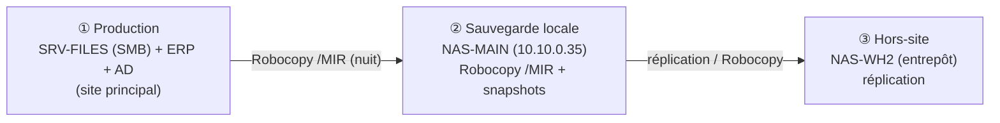
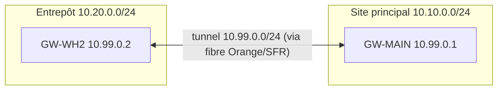
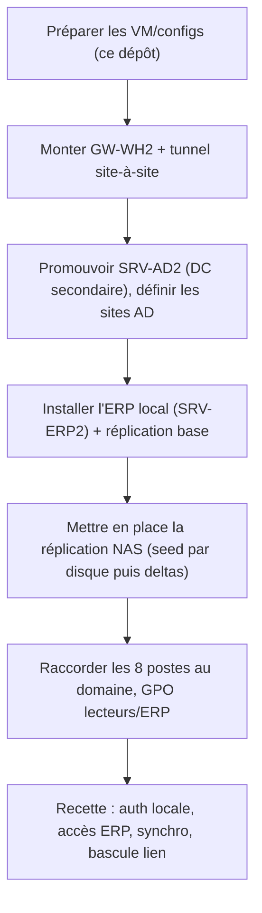
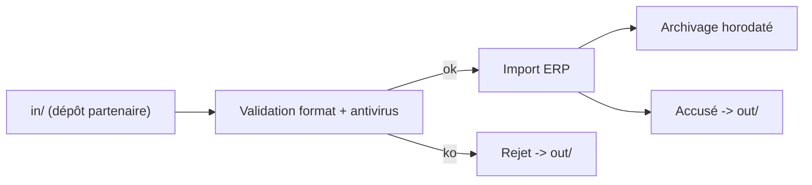
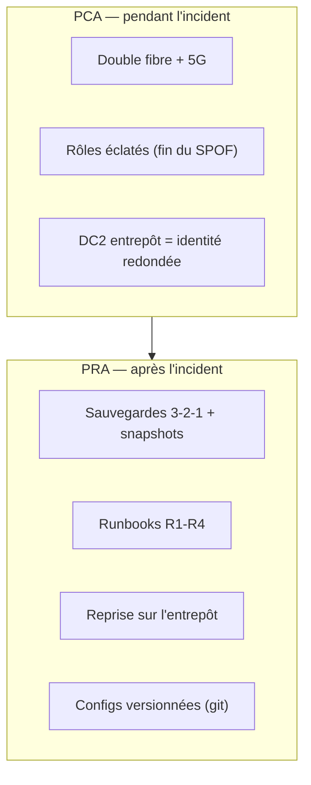

# Dossier technique — MSPR AIRSOLID (Groupe 4)

> Distributeur d'équipements aérauliques et climatisation (~80 personnes). Sortie du **serveur unique de 2012**, résilience Internet, sauvegardes et continuité de l'ERP. Virtualisation sous **VirtualBox**, passerelles **Ubuntu 24.04**.

**Synthèse** : AIRSOLID dépend d'un unique serveur physique de 2012 (AD + ERP + fichiers), sans IT interne, sans sauvegarde, et a subi une **panne de 48 h**. Objectif : supprimer ce **point de défaillance unique** et garantir **« plus jamais 48 h sans ERP »**.

| Besoin (entretiens) | Solution |
|---|---|
| Sortir du serveur unique 2012 (débranché avant fin du mois) | Éclatement des rôles en VM (AD / ERP / fichiers) + décommissionnement |
| « Plus jamais 48 h » (panne = coupure Internet) | Double fibre 2 opérateurs + bascule 5G (watchdog) |
| Aucune sauvegarde | Sauvegarde 3-2-1 avec Robocopy + snapshots NAS + copie hors-site |
| Continuité ERP / fichiers commerciaux | Partage SMB (SRV-FILES) + NAS de sauvegarde/réplication |
| Accès des commerciaux nomades | VPN client OpenVPN vers le SMB et l'ERP |
| Entrepôt secondaire (3 mois, 8 postes, synchro) | VPN site-à-site + DC secondaire + réplication 1 To |
| Flux EDI partenaire logistique | Passerelle SFTP/AS2 isolée en DMZ |
| RTO ERP 24 h | PRA/PCA formalisés et testés |


## Sommaire

- [1. Contexte et analyse du besoin](#1-contexte-et-analyse-du-besoin)
- [2. Architecture cible](#2-architecture-cible)
- [3. Maquette VirtualBox](#3-maquette-virtualbox)
- [4. Décommissionnement du serveur unique et éclatement des rôles](#4-décommissionnement-du-serveur-unique-et-éclatement-des-rôles)
- [5. Résilience Internet (double fibre + 5G)](#5-résilience-internet-double-fibre-5g)
- [6. Sauvegarde 3-2-1 (Robocopy)](#6-sauvegarde-3-2-1-robocopy)
- [7. VPN nomades (accès SMB et ERP)](#7-vpn-nomades-accès-smb-et-erp)
- [8. Entrepôt secondaire (VPN site-à-site et synchronisation)](#8-entrepôt-secondaire-vpn-site-à-site-et-synchronisation)
- [9. Flux EDI sécurisé (partenaire logistique)](#9-flux-edi-sécurisé-partenaire-logistique)
- [10. PRA et PCA (« plus jamais 48 h »)](#10-pra-et-pca-plus-jamais-48-h)
- [11. Tests et recette](#11-tests-et-recette)
- [Annexes — fichiers de configuration et scripts](#annexes--fichiers-de-configuration-et-scripts)

---

# 1. Contexte et analyse du besoin

## 1.1 L'entreprise

AIRSOLID est un distributeur d'**équipements aérauliques et de climatisation**, **~80 personnes**. Particularité : l'**ancien responsable IT est parti** et il n'y a **aucune équipe IT interne**. L'entreprise vit sur un héritage technique fragile qu'il faut moderniser.

**Organisation & sites :**

- **Site principal** — bureaux + logistique légère.
- **Commerciaux nomades** — en déplacement, ont besoin d'accéder aux ressources.
- Quelques **postes atelier** pour du SAV léger.
- **Entrepôt secondaire** — à ouvrir (cf. entretiens : reprise d'un entrepôt d'occasion **dans 3 mois**).

## 1.2 Existant

| Domaine | Outil | Localisation |
|---|---|---|
| Annuaire | Active Directory | **Serveur physique unique (2012)** |
| ERP | Application web interne | **Serveur physique unique (2012)** |
| Fichiers | Partages Windows | **Serveur physique unique (2012)** |
| Collaboration | Microsoft 365 (déploiement en cours) | Cloud |
| Web | Site vitrine institutionnel | (à héberger proprement) |

> ⚠️ **Le problème central** : un **seul serveur physique de 2012** porte l'AD, l'ERP et les partages. C'est à la fois un **point de défaillance unique (SPOF)**, un matériel **obsolète**, et la cause de la paralysie lors de la panne.

## 1.3 Déclencheurs (fiche de situation)

- **Un seul serveur physique (2012)** : AD + ERP web + partages fichiers.
- **Panne de 48 heures récente** : activité commerciale et expéditions **bloquées**.
- **Microsoft 365 en cours** de déploiement.
- **Entrepôt secondaire** prévu (12 mois au départ → revu à **3 mois** au 2ᵉ entretien).
- **Aucune politique de sauvegarde** connue du management.

## 1.4 Contraintes business

- La direction veut **sortir de la dépendance au serveur unique**.
- Charte implicite : **« Plus jamais 48 h sans ERP »** → la continuité de l'ERP est l'exigence n°1.
- **Partenaire logistique à venir** : besoin futur d'un **flux EDI sécurisé**.

## 1.5 Synthèse du 1ᵉʳ entretien

**Cause exacte de la panne de 48 h ?** Une **coupure Internet**. Décision :
- **lien fibre de secours chez un autre opérateur (SFR)** + **box 5G Orange** sur place le temps de la bascule ;
- **box 5G** sur place le temps de la bascule.
→ Objectif : **résilience du lien Internet** (double fibre + 5G).

**Des sauvegardes réalisées et testées ?** **Non, aucune.** Décision : mise en place de sauvegardes via **Robocopy**.

**Services critiques ?** La **partie ERP** et les **fichiers des commerciaux**, accessibles depuis Internet. Il faut assurer la **continuité de service de l'ERP** → soit un **NAS**, soit un **partage SMB**.

**Interruption maximale acceptable pour l'ERP ?** **24 h** — jugé acceptable dès lors que le **lien fibre de secours** existe. → **RTO ERP = 24 h**.

**Accès des commerciaux nomades ?** Mise en place d'un **VPN** pour se connecter au **partage SMB** de l'entreprise.

**Entrepôt secondaire connecté en temps réel à l'ERP ?** Oui, **synchronisation** avec le site principal. **1 To de stockage** prévu.

## 1.6 Synthèse du 2ᵉ entretien (ajouts)

- **Entrepôt secondaire** : finalement **pas neuf** → reprise d'un **entrepôt d'occasion dans 3 mois**, avec **8 postes informatiques**, **ERP installé sur place**.
- **Déconnexion du vieux serveur physique avant la fin du mois** → la migration/éclatement des rôles est **urgente** et prioritaire.
- **Partenaire logistique** : veut ouvrir des **flux EDI avec des accès** dédiés.

## 1.7 Objectifs retenus pour la cible

1. **Éclater le serveur unique** en rôles séparés et virtualisés (AD, ERP, fichiers) et **décommissionner** le serveur 2012 **avant la fin du mois**.
2. **Résilience Internet** : double fibre (2 opérateurs) + **bascule 5G** → « plus jamais 48 h ».
3. **Sauvegarde 3-2-1 avec Robocopy** (dont une copie hors-site).
4. **Continuité ERP / fichiers** : partage **SMB** (et NAS de sauvegarde/réplication).
5. **VPN nomades** pour l'accès distant au partage SMB et à l'ERP.
6. **Entrepôt secondaire** (3 mois) : **VPN site-à-site** + **synchronisation** ERP/fichiers (1 To), DC secondaire.
7. **Flux EDI sécurisé** pour le partenaire logistique.
8. **RTO ERP = 24 h**, formalisé dans un **PRA/PCA**.

## 1.8 Hypothèses & périmètre

- **Virtualisation imposée : VirtualBox.** La box 5G et la 2ᵉ fibre sont **conçues et configurées** ; leur bascule est **démontrée/simulée** dans VirtualBox (interfaces WAN multiples) faute de matériel réel — cf. docs/05.
- **Microsoft 365** (messagerie/collaboration) reste **en l'état** : on ne le réinternalise pas, on sécurise plutôt l'identité (AD) et l'ERP. M365 apporte d'ailleurs une **continuité mail** indépendante du site, ce qui sert le « plus jamais 48 h ».
- L'**entrepôt secondaire** est un chantier **à 3 mois** : sa maquette est fournie et **prête à déployer**, mais il est traité comme une **phase 2** dans le planning.
- Le **flux EDI** est un besoin **futur** : on pose l'architecture sécurisée (passerelle SFTP/AS2 en DMZ) prête à activer à l'arrivée du partenaire.

## 1.9 Lecture clé

Le fil rouge d'AIRSOLID n'est pas l'internalisation (comme ailleurs) mais la **résilience** : supprimer le SPOF (serveur 2012), rendre le lien Internet redondant, et garantir que l'ERP ne tombe plus jamais 48 h. Chaque brique ci-après sert cet objectif.

---

# 2. Architecture cible

## 2.1 Principe général

Deux mouvements complémentaires :

1. **Éclater le serveur unique de 2012** en plusieurs VM aux rôles séparés (annuaire, ERP, fichiers) → fin du point de défaillance unique, puis **décommissionnement** du vieux serveur.
2. **Rendre le site principal résilient** : double accès Internet (2 opérateurs) + secours 5G, sauvegardes 3-2-1, et un **entrepôt secondaire** qui sert aussi de **site de secours** (DC + réplication).

Le site principal héberge les services ; l'entrepôt secondaire (phase 2) s'y raccorde par **VPN site-à-site** et **synchronise** ERP/fichiers. Les **nomades** se connectent par **VPN client**. Le **partenaire logistique** dépose ses flux **EDI** sur une passerelle isolée en **DMZ**.

## 2.2 Schéma de topologie cible



## 2.3 Plan d'adressage

### Réseaux

| Rôle | Réseau | Type VirtualBox | Nom VBox |
|---|---|---|---|
| Internet Orange (fibre principale) | `203.0.113.0/24` | NAT Network | `inet-op-a` |
| Internet SFR (fibre secours) | `198.51.100.0/24` | NAT Network | `inet-op-b` |
| Box 5G Orange (ultime secours) | `192.0.2.0/24` | NAT Network | `inet-5g` |
| LAN site principal | `10.10.0.0/24` | Internal Network | `lan-main` |
| DMZ site principal | `172.16.10.0/24` | Internal Network | `dmz-main` |
| LAN entrepôt secondaire | `10.20.0.0/24` | Internal Network | `lan-wh2` |
| Tunnel site-à-site | `10.99.0.0/24` | (logique OpenVPN) | — |
| Pool VPN nomades | `10.8.0.0/24` | (logique OpenVPN) | — |

### Adresses fixes

| Hôte | WAN | LAN / DMZ | Rôle |
|---|---|---|---|
| GW-MAIN | A 203.0.113.11 · B 198.51.100.11 · 5G 192.0.2.11 | 10.10.0.254 / 172.16.10.254 | Passerelle, failover WAN, OpenVPN |
| SRV-AD1 | — | 10.10.0.10 | AD DS + DNS (primaire) |
| SRV-ERP | — | 10.10.0.20 | ERP web |
| SRV-FILES | — | 10.10.0.30 | Partage SMB (commerciaux/ERP) |
| NAS-MAIN | — | 10.10.0.35 | Sauvegarde Robocopy + réplication |
| SRV-WEB | — | 172.16.10.10 (DMZ) | Site vitrine |
| SRV-EDI | — | 172.16.10.20 (DMZ) | Passerelle EDI/SFTP |
| GW-WH2 | 203.0.113.12 | 10.20.0.254 | Passerelle entrepôt secondaire |
| SRV-AD2 | — | 10.20.0.10 | DC secondaire + DNS |
| SRV-ERP2 | — | 10.20.0.20 | ERP local synchronisé |
| NAS-WH2 | — | 10.20.0.30 | Réplication 1 To |
| Postes WH2 | — | 10.20.0.50-57 | 8 postes |

## 2.4 Du « serveur unique » aux rôles séparés



Bénéfice immédiat : la panne d'un rôle n'entraîne plus la chute de tout le SI, et l'AD est **redondé** (DC secondaire à l'entrepôt) → l'authentification survit à une panne du site principal.

## 2.5 Choix techniques justifiés

| Choix | Justification |
|---|---|
| **Éclatement en VM** (vs garder le monolithe) | Supprime le SPOF, isole les pannes, permet sauvegarde/restauration par rôle, prépare la haute dispo. |
| **Double fibre Orange + SFR + 5G** | Réponse directe à la panne de 48 h. Deux opérateurs **distincts** (Orange/SFR) = pannes indépendantes ; un opérateur seul retomberait dans le même risque. La box 5G (Orange) couvre la bascule. |
| **Partage SMB (SRV-FILES) + NAS de sauvegarde** | « soit NAS soit SMB » → SMB pour l'accès commerciaux/ERP, NAS comme cible de sauvegarde et de réplication hors-site. |
| **Robocopy** | Outil natif Windows demandé par le client ; `/MIR` fiable, journalisé, planifiable, sans licence. |
| **OpenVPN** | Léger, PKI claire, configs versionnables ; gère site-à-site **et** nomades ; multi-`remote` pour suivre la bascule WAN. |
| **Entrepôt = site de secours** | Le DC secondaire + la réplication 1 To en font un vrai point de reprise (PRA) en plus de son rôle métier. |
| **EDI en DMZ (SFTP/AS2)** | Le partenaire n'atteint jamais le LAN ni l'ERP directement ; dépôt isolé, ingéré ensuite en interne. |

## 2.6 Phasage


---

# 3. Maquette VirtualBox

## 3.1 Inventaire des machines virtuelles

| VM | OS | vCPU | RAM | Disque | Réseaux (NIC1 → …) |
|---|---|---|---|---|---|
| `GW-MAIN` | Ubuntu 24.04 | 1 | 768 Mo | 10 Go | NAT `inet-op-a` / NAT `inet-op-b` / Internal `lan-main` / Internal `dmz-main` |
| `SRV-AD1` | Windows Server 2022 | 2 | 2048 Mo | 40 Go | Internal `lan-main` |
| `SRV-ERP` | Ubuntu 24.04 | 2 | 2048 Mo | 30 Go | Internal `lan-main` |
| `SRV-FILES` | Windows Server 2022 | 2 | 2048 Mo | 60 Go | Internal `lan-main` |
| `NAS-MAIN` | TrueNAS SCALE (ou Ubuntu+Samba) | 2 | 2048 Mo | 80 Go | Internal `lan-main` |
| `SRV-WEB` | Ubuntu 24.04 | 1 | 512 Mo | 10 Go | Internal `dmz-main` |
| `SRV-EDI` | Ubuntu 24.04 | 1 | 512 Mo | 15 Go | Internal `dmz-main` |
| `GW-WH2` | Ubuntu 24.04 | 1 | 512 Mo | 10 Go | NAT `inet-op-a` / Internal `lan-wh2` |
| `SRV-AD2` | Windows Server 2022 (Core) | 2 | 2048 Mo | 40 Go | Internal `lan-wh2` |
| `SRV-ERP2` | Ubuntu 24.04 | 2 | 2048 Mo | 30 Go | Internal `lan-wh2` |
| `NAS-WH2` | TrueNAS SCALE (ou Ubuntu+Samba) | 2 | 1024 Mo | 80 Go | Internal `lan-wh2` |
| `PC-WH2` (×1 témoin) | Windows 10/11 | 2 | 2048 Mo | 40 Go | Internal `lan-wh2` |

> Les **8 postes** de l'entrepôt sont représentés par **1 poste témoin** dans la maquette (suffisant pour prouver l'authentification et l'accès). La box 5G (3ᵉ WAN) est documentée et ajoutable en NIC supplémentaire ; on démontre la bascule **fibre Orange → fibre SFR** (docs/05).

### Fonctionnement par scénarios (RAM)

Tout démarré ≈ 18-20 Go. On lance par groupe :

- **Phase 0 — éclatement & décommissionnement** : `GW-MAIN`, `SRV-AD1`, `SRV-ERP`, `SRV-FILES` (~7 Go).
- **Résilience Internet** : `GW-MAIN` seule + un poste LAN (~2 Go) — couper/rétablir les WAN.
- **Sauvegarde** : `SRV-FILES`, `NAS-MAIN` (~4 Go).
- **VPN nomades** : `GW-MAIN`, `SRV-FILES`, une VM « nomade » (~5 Go).
- **Entrepôt secondaire** : `GW-MAIN`, `GW-WH2`, `SRV-AD1`, `SRV-AD2`, `SRV-ERP(2)` (~9 Go).

Astuces : Windows Server en **Core**, disques **dynamiques**, audio/USB désactivés.

## 3.2 Schéma de câblage virtuel



## 3.3 Création des réseaux

```bash
# Deux "opérateurs" Internet (plages de documentation, isolées l'une de l'autre)
VBoxManage natnetwork add --netname inet-op-a --network "203.0.113.0/24" --enable --dhcp off
VBoxManage natnetwork add --netname inet-op-b --network "198.51.100.0/24" --enable --dhcp off
# (optionnel) box 5G — 3e opérateur
VBoxManage natnetwork add --netname inet-5g  --network "192.0.2.0/24"   --enable --dhcp off

# Les Internal Networks (lan-main, dmz-main, lan-wh2) se créent à l'attachement.
```

> Deux NAT Networks **distincts** = deux opérateurs indépendants. Couper l'un (désactiver le NIC correspondant) ne coupe pas l'autre → on peut démontrer la **bascule**.

## 3.4 Provisioning (exemple passerelle principale)

```bash
VM="GW-MAIN"
VBoxManage createvm --name "$VM" --ostype Ubuntu24_LTS_64 --register
VBoxManage modifyvm "$VM" --memory 768 --cpus 1 --paravirtprovider default
VBoxManage createhd --filename "$HOME/VirtualBox VMs/$VM/$VM.vdi" --size 10000 --variant Standard
VBoxManage storagectl "$VM" --name SATA --add sata --controller IntelAhci
VBoxManage storageattach "$VM" --storagectl SATA --port 0 --device 0 --type hdd \
  --medium "$HOME/VirtualBox VMs/$VM/$VM.vdi"
VBoxManage storageattach "$VM" --storagectl SATA --port 1 --device 0 --type dvddrive \
  --medium "$HOME/iso/ubuntu-24.04-live-server-amd64.iso"

# NIC1 = WAN-A, NIC2 = WAN-B, NIC3 = LAN, NIC4 = DMZ
VBoxManage modifyvm "$VM" --nic1 natnetwork --nat-network1 inet-op-a
VBoxManage modifyvm "$VM" --nic2 natnetwork --nat-network2 inet-op-b
VBoxManage modifyvm "$VM" --nic3 intnet --intnet3 lan-main
VBoxManage modifyvm "$VM" --nic4 intnet --intnet4 dmz-main
```

Automatisé dans `scripts/provision-virtualbox.sh`.

## 3.5 Configuration réseau (Ubuntu 24.04 → Netplan)

Ubuntu 24.04 utilise **Netplan** (`/etc/netplan/*.yaml`, renderer `systemd-networkd`, `sudo netplan apply`). Le YAML est **sensible à l'indentation** (espaces) et doit être en **permissions 600**.

### Passerelle principale — `/etc/netplan/01-airsolid.yaml`

La double fibre est gérée par **métriques de route** (la plus basse gagne) ; un *watchdog* bascule en cas de perte (docs/05). Fichier complet : `configs/network/netplan-gw-main.yaml`.

```yaml
network:
  version: 2
  renderer: networkd
  ethernets:
    enp0s3:                        # WAN-A — fibre principale (Orange)
      dhcp4: false
      addresses: [203.0.113.11/24]
      routes:
        - to: default
          via: 203.0.113.1
          metric: 100
    enp0s8:                        # WAN-B — fibre secours (SFR)
      dhcp4: false
      addresses: [198.51.100.11/24]
      routes:
        - to: default
          via: 198.51.100.1
          metric: 200
    enp0s9:                        # LAN site principal
      dhcp4: false
      addresses: [10.10.0.254/24]
    enp0s10:                       # DMZ
      dhcp4: false
      addresses: [172.16.10.254/24]
  # nameservers globaux (résolution Internet pour les MAJ)
```
```bash
sudo chmod 600 /etc/netplan/01-airsolid.yaml && sudo netplan apply
echo 'net.ipv4.ip_forward = 1' | sudo tee /etc/sysctl.d/99-routing.conf
sudo sysctl --system
```

### Exemple serveur LAN (ERP) — `/etc/netplan/01-airsolid.yaml`

```yaml
network:
  version: 2
  renderer: networkd
  ethernets:
    enp0s3:
      dhcp4: false
      addresses: [10.10.0.20/24]
      routes:
        - to: default
          via: 10.10.0.254
      nameservers:
        addresses: [10.10.0.10]    # SRV-AD1 (DNS)
        search: [airsolid.lan]
```

## 3.6 Vérifications de base

```bash
# La passerelle sort-elle par les DEUX opérateurs ?
ping -c2 -I enp0s3 archive.ubuntu.com    # via fibre Orange
ping -c2 -I enp0s8 archive.ubuntu.com    # via fibre SFR

# Un serveur du LAN atteint-il Internet via la passerelle ?
ping -c2 10.10.0.254 && ping -c2 1.1.1.1
```

---

# 4. Décommissionnement du serveur unique et éclatement des rôles

C'est le cœur du sujet. Le serveur physique de **2012** porte l'AD, l'ERP et les partages : il doit être **éclaté** en rôles séparés puis **débranché avant la fin du mois** (2ᵉ entretien). Cette phase est prioritaire.

## 4.1 Cible : un rôle = une VM

| Rôle (ancien serveur) | Nouvelle VM | OS | Bénéfice |
|---|---|---|---|
| Active Directory + DNS | `SRV-AD1` (+ `SRV-AD2` à l'entrepôt) | Windows Server 2022 | Annuaire **redondé**, plus de SPOF identité |
| ERP web | `SRV-ERP` | Ubuntu/Windows selon l'ERP | Isolé, sauvegardable/restaurable seul |
| Partages fichiers | `SRV-FILES` (SMB) + `NAS-MAIN` (sauvegarde) | Windows Server 2022 + NAS | Continuité fichiers + cible de sauvegarde |

## 4.2 Stratégie de migration (sans rupture de 48 h)

On migre **rôle par rôle**, en validant chaque étape avant de débrancher l'ancien serveur. Principe : **ajouter le nouveau, basculer, vérifier, puis retirer l'ancien**.



### Étape 1 — Active Directory (le plus délicat)

```powershell
# Sur SRV-AD1 (Windows Server 2022), après jonction au domaine :
Install-WindowsFeature AD-Domain-Services -IncludeManagementTools
Install-ADDSDomainController -DomainName "airsolid.lan" -InstallDns -Credential (Get-Credential)
# Vérifier la réplication avec l'ancien DC
repadmin /replsummary
# Transférer les 5 rôles FSMO vers SRV-AD1
Move-ADDirectoryServerOperationMasterRole -Identity "SRV-AD1" -OperationMasterRole 0,1,2,3,4
```

> On **ne supprime pas** l'ancien DC tant que la réplication n'est pas saine et les FSMO transférés. C'est ce qui évite une coupure d'authentification.

### Étape 2 — Fichiers (avec Robocopy, déjà l'outil de sauvegarde)

```bat
:: Copie miroir des partages vers SRV-FILES, en conservant ACL/attributs/horodatages
robocopy \\ANCIEN-SRV\Donnees \\SRV-FILES\Donnees /MIR /COPYALL /R:2 /W:5 /LOG:C:\migration\donnees.log
```

`/COPYALL` conserve les **permissions NTFS** (essentiel pour ne pas casser les accès commerciaux). On recrée les **partages SMB** et on bascule les **lecteurs réseau** des postes via GPO.

### Étape 3 — ERP

L'ERP est une **application web interne**. Migration = réinstaller l'applicatif sur `SRV-ERP` + migrer sa **base de données** (export/import) + ses **fichiers liés** (souvent les pièces des commerciaux). Validation par un **groupe pilote** avant bascule générale. Selon la techno (PHP/MySQL, .NET/SQL Server…), adapter ; le principe reste : *nouveau serveur en parallèle, tests, bascule, retrait de l'ancien*.

### Étape 4 — Bascule clients

- DNS : les postes pointent vers `SRV-AD1` (10.10.0.10).
- Lecteurs réseau : GPO mise à jour vers `\\SRV-FILES\…`.
- URL ERP : redirigée vers `SRV-ERP` (10.10.0.20).

### Étape 5 — Retrait de l'ancien serveur 2012

```powershell
# Rétrograder proprement l'ancien DC AVANT extinction
Uninstall-ADDSDomainController -DemoteOperationMasterRole -Credential (Get-Credential)
```

Puis arrêt et débranchement physique. **Conserver le disque** quelques semaines (filet de sécurité) avant recyclage.

## 4.3 Partage SMB & permissions (SRV-FILES)

Structure type, alignée sur les groupes AD (moindre privilège) :

```
\\SRV-FILES\Commerciaux      → groupe AD "GG_Commerciaux"  (Modifier)
\\SRV-FILES\ERP-Donnees      → groupe AD "GG_ERP"          (Modifier)
\\SRV-FILES\Public           → "Utilisateurs du domaine"   (Lecture)
\\SRV-FILES\Direction        → groupe AD "GG_Direction"    (Modifier)
```

Détails de configuration : `configs/smb/partages-srv-files.md`. Le partage SMB est la **ressource cible du VPN nomades** (docs/07) et la **source des sauvegardes Robocopy** (docs/06).

## 4.4 NAS (continuité & sauvegarde)

`NAS-MAIN` (TrueNAS SCALE recommandé, ou Ubuntu + Samba) joue trois rôles :

- **cible de sauvegarde** des Robocopy (copie ②),
- **snapshots** réguliers (protection anti-ransomware / suppression),
- **réplication** vers `NAS-WH2` à l'entrepôt (copie ③ hors-site, docs/08).

> Choix NAS vs simple partage SMB : le NAS apporte **snapshots** et **réplication** natifs, ce qu'un partage Windows seul ne fait pas aussi simplement — d'où le couple **SRV-FILES (accès) + NAS (sauvegarde/réplication)**.

## 4.5 Résultat

À l'issue de la phase 0 : plus de serveur unique, chaque rôle est isolé et sauvegardable, l'AD est prêt à être redondé (DC secondaire à l'entrepôt), et le vieux matériel de 2012 est retiré **dans les délais** demandés.

---

# 5. Résilience Internet (double fibre + 5G)

C'est la réponse directe à la **panne de 48 h** et à la charte **« plus jamais 48 h sans ERP »**. La cause était une **coupure Internet** ; la parade est un **accès Internet redondant** : **fibre principale Orange** + **fibre de secours SFR** (deux opérateurs distincts) + **box 5G Orange** en relais immédiat.

## 5.1 Prestataires & installation

Pour ne pas dépendre d'une seule infrastructure, deux prestataires ont été sollicités :

- un **prestataire Orange** pour l'installation de la **fibre principale** et la fourniture d'une **box 5G** (relais mobile sur site) ;
- un **prestataire SFR** pour l'installation d'une **fibre de secours** sur un réseau opérateur **indépendant**.

Concrètement : la **box 5G d'Orange** assure le relais **immédiat** sur place « le temps de la bascule » (le watchdog ne met que quelques secondes à basculer, et la 5G couvre aussi la période avant l'activation de la fibre SFR), tandis que la **fibre SFR** apporte la vraie **redondance opérateur** pour une coupure prolongée.

> ⚠️ **Point de vigilance** : la fibre principale **et** la box 5G proviennent toutes deux d'**Orange**. Une panne nationale Orange les affecterait ensemble — c'est précisément pourquoi la **fibre de secours SFR**, sur un réseau **indépendant**, est la brique de résilience essentielle. La 5G reste un excellent **relais de transition**, pas la redondance principale.

## 5.2 Principe de bascule



La passerelle a trois routes par défaut, de **métriques croissantes** : le trafic emprunte la plus prioritaire **disponible**. Un **watchdog** teste en continu la connectivité réelle de chaque lien et ajuste les routes (le noyau ne détecte pas seul une coupure côté opérateur).

> Pourquoi deux **opérateurs différents** : si A et B passaient par le même opérateur, une panne backbone les couperait ensemble. Deux opérateurs = pannes indépendantes.

## 5.3 Configuration Netplan (métriques)

Voir `configs/network/netplan-gw-main.yaml`. Les trois WAN portent des métriques 100 / 200 / 300. En fonctionnement nominal, tout sort par la fibre Orange.

## 5.4 Watchdog de bascule

Le script `scripts/wan-failover.sh` (lancé en service systemd, toutes les 10 s) :

1. teste un ping de contrôle **via chaque interface** (`ping -I enpXsY`),
2. garde comme route par défaut le **premier lien sain** dans l'ordre A → B → 5G,
3. journalise chaque bascule (et peut alerter par mail).

Extrait de la logique :

```bash
PROBE="1.1.1.1"
declare -A WAN=( [enp0s3]="203.0.113.1" [enp0s8]="198.51.100.1" [enp0s9_5g]="192.0.2.1" )
ORDER=(enp0s3 enp0s8 enp0s9_5g)   # priorité A, B, 5G

healthy() { ping -c2 -W2 -I "$1" "$PROBE" >/dev/null 2>&1; }

for IF in "${ORDER[@]}"; do
  if healthy "$IF"; then
    ip route replace default via "${WAN[$IF]}" dev "$IF"
    logger "WAN actif : $IF"
    break
  fi
done
```

Installation comme service : `configs/network/wan-failover.service` + un *timer* systemd (ou une boucle `sleep`).

## 5.5 Résilience du VPN face à la bascule

Les tunnels (nomades et site-à-site) doivent survivre à un changement de lien. Côté **clients OpenVPN**, on déclare **plusieurs `remote`** — l'un par IP publique d'opérateur :

```ini
remote 203.0.113.11 1194 udp     # via fibre Orange
remote 198.51.100.11 1194 udp    # via fibre SFR
remote-random
resolv-retry infinite
```

Si la fibre Orange tombe, le client re-tente automatiquement sur l'IP de la fibre SFR. Le serveur OpenVPN écoute sur **toutes** ses interfaces (pas de `local` figé), donc il répond sur le lien encore actif.

## 5.6 Continuité ERP pendant un incident lien

- L'ERP et les fichiers étant **internes** (LAN), ils restent accessibles **sur site** même si Internet est coupé : la logistique et les bureaux continuent en local.
- Les **nomades** et l'**entrepôt** retrouvent l'accès dès que le lien de secours a pris le relais (quelques secondes à quelques dizaines de secondes).
- M365 (mail) dépend d'Internet mais bascule avec le lien de secours.

→ Combinée au RTO ERP de **24 h** validé par le client, cette résilience rend une coupure de 48 h **structurellement impossible** : il faudrait perdre **simultanément** deux opérateurs **et** la 5G.

## 5.7 Démonstration en maquette (et limite assumée)

**Démontrable intégralement** dans VirtualBox pour l'**accès Internet sortant** :

```bash
# État nominal : sortie par la fibre Orange
ip route | grep default        # via 203.0.113.1 (enp0s3)

# Simuler la panne de la fibre Orange : désactiver le NIC WAN-A
VBoxManage controlvm GW-MAIN setlinkstate1 off
# Le watchdog bascule : la route par défaut passe sur la fibre SFR
ip route | grep default        # via 198.51.100.1 (enp0s8)
ping -c2 1.1.1.1               # Internet toujours joignable
```

**Limite assumée** : simuler la *bascule du VPN lui-même* côté client suppose qu'un poste nomade puisse atteindre **deux opérateurs indépendants** depuis un seul hôte VirtualBox, ce qui dépasse une maquette mono-poste. La résilience VPN est donc **conçue et configurée** (multi-`remote`, écoute sur toutes interfaces) et **raisonnée**, la bascule **Internet** étant, elle, **prouvée** par le test ci-dessus. *(Même approche honnête que pour la 5G : conçue, configurée, partiellement simulée.)*

---

# 6. Sauvegarde 3-2-1 (Robocopy)

Aujourd'hui : **aucune sauvegarde**, rien de testé. Le client a retenu **Robocopy** (outil natif Windows, fiable, gratuit, planifiable). On l'inscrit dans une stratégie **3-2-1**.

## 6.1 La règle 3-2-1 chez AIRSOLID

> **3** copies · **2** supports différents · **1** hors-site.



| Copie | Emplacement | Support | Rôle |
|---|---|---|---|
| ① Production | SRV-FILES, SRV-ERP, AD | Disques de prod | Données vivantes |
| ② Locale | NAS-MAIN | NAS (autre matériel) | Restauration rapide + snapshots |
| ③ Hors-site | NAS-WH2 (entrepôt, 3 mois) | NAS distant | Survie à un sinistre du site principal |

> **2 supports** : ② est sur un NAS distinct des serveurs ; ③ est sur un **autre site**. Les **snapshots** du NAS ajoutent une protection contre le ransomware (Robocopy `/MIR` propage une suppression — les snapshots permettent de remonter avant).

## 6.2 Sauvegarde des fichiers — Robocopy `/MIR`

Tâche planifiée nocturne sur `SRV-FILES`. Script complet : `configs/backup/backup-robocopy.ps1`.

```powershell
# Miroir des partages vers le NAS, journalisé
$date = Get-Date -Format "yyyyMMdd"
robocopy "D:\Partages" "\\NAS-MAIN\backup\partages" /MIR /COPYALL /R:2 /W:5 /Z `
  /LOG:"C:\backup\logs\partages_$date.log" /NP /TEE
```

- `/MIR` : miroir (ajoute/met à jour/supprime pour refléter la source).
- `/COPYALL` : conserve données **+ ACL NTFS + attributs + horodatages**.
- `/Z` : mode redémarrable (reprise si coupure).
- `/R:2 /W:5` : 2 essais, 5 s d'attente (évite de bloquer sur un fichier verrouillé).
- `/LOG /NP /TEE` : journal daté, sans barre de progression, affiché aussi à l'écran.

### Planification

```powershell
# Tâche planifiée quotidienne à 22h00
$action  = New-ScheduledTaskAction -Execute "powershell.exe" `
  -Argument "-File C:\backup\backup-robocopy.ps1"
$trigger = New-ScheduledTaskTrigger -Daily -At 22:00
Register-ScheduledTask -TaskName "Sauvegarde-Robocopy" -Action $action -Trigger $trigger `
  -User "AIRSOLID\svc_backup" -RunLevel Highest
```

## 6.3 Sauvegarde de l'ERP et de l'AD

- **Base ERP** : export/dump planifié (ex. `mysqldump` / sauvegarde SQL Server) **avant** le Robocopy, vers un dossier inclus dans le miroir. Les **fichiers liés** de l'ERP (pièces commerciaux) sont sur SRV-FILES → déjà couverts.
- **AD** : sauvegarde **System State** du DC (`wbadmin start systemstatebackup`) vers le NAS, planifiée quotidiennement. La redondance par DC secondaire (docs/08) complète, sans remplacer, la sauvegarde.

## 6.4 Copie hors-site (③)

Quand l'entrepôt sera en service (3 mois), le NAS-MAIN **réplique** vers NAS-WH2 à travers le **VPN site-à-site**. En attendant, solution transitoire : un **disque externe rotatif** (sorti du site) comme 3ᵉ copie — `robocopy` vers le disque, puis stockage hors-site. Cela respecte le 3-2-1 dès la phase 1.

## 6.5 Rétention (proposition)

| Données | Fréquence | Rétention locale (NAS ②) | Hors-site (③) |
|---|---|---|---|
| Partages fichiers / pièces commerciaux | Quotidienne | 30 jours (+ snapshots) | 90 jours |
| Base ERP | Quotidienne | 30 jours | 90 jours |
| AD System State | Quotidienne | 15 jours | 30 jours |
| Archive mensuelle | Mensuelle | 12 mois | 12 mois |

Les **snapshots NAS** (horaires/quotidiens) offrent un point de retour fin entre deux sauvegardes Robocopy.

## 6.6 Tests de restauration (le maillon absent aujourd'hui)

Une sauvegarde non testée ne compte pas. On planifie :

| Test | Fréquence | Critère |
|---|---|---|
| Restauration d'un fichier commercial | Mensuelle | Fichier intègre, ACL préservées, < 30 min |
| Restauration de la base ERP | Trimestrielle | Base montée, cohérente, < RTO 24 h |
| Restauration AD (objet / System State) | Trimestrielle | Objet/compte restauré |
| Reconstruction complète SRV-FILES | Semestrielle | Serveur opérationnel depuis ② |

Chaque test → **procès-verbal** daté (docs/11).

---

# 7. VPN nomades (accès SMB et ERP)

Les **commerciaux nomades** doivent atteindre le **partage SMB** (et l'ERP) de l'entreprise depuis l'extérieur. Aujourd'hui l'accès « par Internet » est flou et peu sûr ; on le remplace par un **VPN client OpenVPN** terminé sur la passerelle du site principal.

## 07.1 Pourquoi un VPN (et pas un partage exposé)

Exposer un partage SMB directement sur Internet est **dangereux** (le port SMB est une cible majeure de ransomware). Le VPN crée un tunnel chiffré : le nomade se retrouve « comme sur le LAN » et accède au SMB/ERP **sans** rien exposer publiquement.

## 07.2 PKI & certificats nominatifs

Comme pour le site-à-site, on s'appuie sur une **PKI Easy-RSA** (générée sur la passerelle). **Un certificat par commercial** → traçabilité et révocation individuelle (perte de portable, départ).

```bash
./easyrsa gen-req com-dupont nopass
./easyrsa sign-req client com-dupont
```

Génération du profil prêt à l'emploi : `scripts/make-ovpn.sh`.

## 07.3 Serveur OpenVPN nomades

Instance dédiée sur `GW-MAIN`. Fichier complet : `configs/openvpn/server-roadwarrior.conf`.

```ini
port 1194
proto udp
dev tun

ca       ca.crt
cert     gw-main.crt
key      gw-main.key
dh       dh.pem
tls-auth ta.key 0

topology subnet
server 10.8.0.0 255.255.255.0

# Accès aux ressources internes : LAN (SMB, ERP) + DNS interne
push "route 10.10.0.0 255.255.255.0"
push "dhcp-option DNS 10.10.0.10"
push "dhcp-option DOMAIN airsolid.lan"

# Split-tunnel : seul le trafic interne passe par le VPN
keepalive 10 120
cipher AES-256-GCM
auth SHA256
tls-version-min 1.2
remote-cert-tls client
persist-key
persist-tun
user nobody
group nogroup
status /var/log/openvpn/rw-status.log
verb 3
```

## 07.4 Profil client (résilient à la bascule WAN)

Le profil `.ovpn` liste **les deux IP publiques** (fibre Orange et fibre SFR) pour survivre à une coupure d'opérateur (docs/05). Modèle : `configs/openvpn/client-roadwarrior.ovpn`.

```ini
client
dev tun
proto udp
remote 203.0.113.11 1194     # fibre Orange
remote 198.51.100.11 1194    # fibre SFR
remote-random
resolv-retry infinite
nobind
remote-cert-tls server
cipher AES-256-GCM
auth SHA256
# <ca>/<cert>/<key>/<tls-auth> injectés par make-ovpn.sh
key-direction 1
```

## 07.5 Accès au partage SMB une fois connecté

Une fois le tunnel monté, le nomade accède au partage **par son nom** (résolution via le DNS interne poussé) :

```
\\SRV-FILES\Commerciaux
```

Les **permissions NTFS** s'appliquent normalement (il est authentifié sur le domaine via ses identifiants AD) — il ne voit que ce que son groupe autorise. L'**ERP web** est accessible via son URL interne `http://srv-erp.airsolid.lan`.

## 07.6 Pare-feu

Sur `GW-MAIN`, ouvrir le port VPN sur **les deux WAN** et autoriser le forwarding du pool nomade vers le LAN. Extrait nftables (`configs/network/nftables-gw-main.conf`) :

```bash
# OpenVPN entrant sur fibre Orange et fibre SFR
udp dport 1194 iifname { "enp0s3", "enp0s8" } accept
# Forwarding pool nomades <-> LAN
iifname "tun0" oifname "enp0s9" accept
iifname "enp0s9" oifname "tun0" accept
```

## 07.7 Révocation (perte de portable / départ)

```bash
cd ~/easyrsa
./easyrsa revoke com-dupont
./easyrsa gen-crl
sudo cp pki/crl.pem /etc/openvpn/server/
# activer 'crl-verify crl.pem' dans la conf serveur puis :
sudo systemctl restart openvpn-server@roadwarrior
```

## 07.8 Mise en service & test

```bash
sudo systemctl enable --now openvpn-server@roadwarrior
# Côté nomade : importer le .ovpn, se connecter, puis
ping 10.10.0.30                       # SRV-FILES répond
net use Z: \\SRV-FILES\Commerciaux    # accès au partage
curl -I http://srv-erp.airsolid.lan   # ERP joignable
```

---

# 8. Entrepôt secondaire (VPN site-à-site et synchronisation)

Phase 2, à **~3 mois** : reprise d'un **entrepôt d'occasion**, **8 postes**, **ERP installé sur place**, et **synchronisation** avec le site principal (**1 To**). L'entrepôt sert aussi de **site de secours** (DC secondaire + réplication des sauvegardes).

## 8.1 Raccordement par VPN site-à-site

Tunnel **OpenVPN** permanent entre `GW-WH2` (client) et `GW-MAIN` (serveur). Le site principal est le concentrateur ; l'entrepôt est une branche — même logique que le VPN nomades, mais pour relier deux LAN.



### Serveur (site principal) — extrait

Fichier complet : `configs/openvpn/server-site2site.conf`.

```ini
port 1195
proto udp
dev tun
topology subnet
server 10.99.0.0 255.255.255.0
client-config-dir /etc/openvpn/ccd
route 10.20.0.0 255.255.255.0
push "route 10.10.0.0 255.255.255.0"
push "route 10.20.0.0 255.255.255.0"
# ... ca/cert/key/dh/tls-auth + durcissement identiques au reste
```

`/etc/openvpn/ccd/wh2` :
```ini
ifconfig-push 10.99.0.2 255.255.255.0
iroute 10.20.0.0 255.255.255.0
```

### Client (entrepôt) — extrait

Fichier complet : `configs/openvpn/client-wh2.conf`. Comme les nomades, il liste **les deux IP d'opérateur** pour suivre la bascule WAN.

```ini
client
dev tun
proto udp
remote 203.0.113.11 1195    # fibre Orange
remote 198.51.100.11 1195   # fibre SFR
remote-random
# ... ca/cert/key wh2 + tls-auth
```

## 8.2 DC secondaire (continuité de l'identité)

`SRV-AD2` (Windows Server Core) est promu **contrôleur de domaine additionnel** du domaine `airsolid.lan`, répliqué depuis `SRV-AD1` via le tunnel. Bénéfices :

- l'**authentification survit** à une panne du site principal (les 8 postes de l'entrepôt continuent de se connecter) ;
- résolution **DNS locale** à l'entrepôt (DC2 = DNS) → moins de dépendance au lien.

```powershell
Install-ADDSDomainController -DomainName "airsolid.lan" -InstallDns -Credential (Get-Credential)
repadmin /replsummary    # vérifier la réplication AD inter-sites
```

> On définit aussi les **sites AD** (Sites and Services) : sous-réseaux 10.10.0.0/24 et 10.20.0.0/24, avec un lien de site, pour que les postes s'authentifient sur **leur** DC local.

## 8.3 Synchronisation ERP & fichiers (1 To)

Deux flux à synchroniser entre les sites, via le tunnel :

| Donnée | Mécanisme proposé | Sens |
|---|---|---|
| **Base ERP** | Réplication base de données (ex. réplica PostgreSQL/MySQL, ou réplication SQL Server) | Principal → Entrepôt (lecture locale) ; écritures arbitrées par l'ERP |
| **Fichiers / pièces** | Réplication NAS (snapshots ZFS *send/receive*) **ou** DFS-R entre SRV-FILES et un serveur de fichiers WH2 | Bidirectionnel/maître selon l'usage |
| **Sauvegardes (③)** | Réplication NAS-MAIN → NAS-WH2 | Principal → Entrepôt (hors-site) |

> « Synchroniser en temps réel » : pour l'ERP, la solution propre est une **réplication de base** (le client travaille sur l'instance, pas sur des copies de fichiers divergentes). Le détail dépend de la techno exacte de l'ERP — on pose ici le **mécanisme** (réplication DB + réplication NAS) ; le paramétrage fin se fait à l'installation sur site.

### Dimensionnement

- **1 To** de stockage prévu côté entrepôt (NAS-WH2) : couvre la réplication des fichiers + une rétention de sauvegarde hors-site.
- Bande passante : la **synchro initiale** (seed) peut se faire **par disque physique** transporté (le 1 To complet), puis seuls les **deltas** transitent par le VPN — on évite de saturer la fibre au démarrage.

## 8.4 Installation sur place (déroulé 3 mois)



## 8.5 Double bénéfice : métier + secours

L'entrepôt n'est pas qu'un site de production : avec son **DC secondaire** et sa **copie hors-site (③)**, il devient le **site de reprise** du PRA. Une panne majeure du site principal n'efface plus ni l'identité ni les données. Cf. docs/10.

---

# 9. Flux EDI sécurisé (partenaire logistique)

Besoin **futur** (phase 3) : le **partenaire logistique** veut échanger des données (commandes, avis d'expédition, stocks…) via **EDI**, avec des **accès dédiés**. L'enjeu : ouvrir un canal **maîtrisé** vers l'extérieur **sans** exposer l'ERP ni le LAN.

## 9.1 Principe : une passerelle EDI isolée en DMZ

Le partenaire ne touche **jamais** directement l'ERP. Il dépose/récupère ses fichiers sur une **passerelle EDI** (`SRV-EDI`, 172.16.10.20) en **DMZ**. Un processus interne **va chercher** ces fichiers et les ingère dans l'ERP. Le flux est ainsi **découplé** et **filtré**.


## 9.2 Transport : SFTP (et/ou AS2)

- **SFTP** : simple, chiffré (SSH), authentification par **clé** + IP autorisée. Adapté pour des dépôts de fichiers EDI (EDIFACT, CSV, XML).
- **AS2** : standard EDI « historique » (accusés MDN, signatures) si le partenaire l'exige. Mise en œuvre via un logiciel dédié sur la même passerelle.

On part sur **SFTP chrooté** par défaut, AS2 en option selon l'exigence du partenaire.

### Compte SFTP dédié, chrooté, sans shell

Extrait `sshd_config` (`configs/edi/sshd-edi.conf`) :

```
Match Group sftp-edi
    ChrootDirectory /srv/edi/%u
    ForceCommand internal-sftp
    AllowTcpForwarding no
    X11Forwarding no
    PermitTunnel no
    AuthenticationMethods publickey
```

```bash
# Création du compte partenaire (sans shell), clé publique fournie par le partenaire
sudo groupadd sftp-edi
sudo useradd -m -d /srv/edi/partenaire1 -s /usr/sbin/nologin -G sftp-edi partenaire1
sudo mkdir -p /srv/edi/partenaire1/{in,out} && sudo chown partenaire1 /srv/edi/partenaire1/{in,out}
```

Le partenaire dépose dans `in/`, lit ses accusés/retours dans `out/`. Le **chroot** l'enferme dans son dossier.

## 9.3 Filtrage réseau

Le partenaire n'atteint que le **port 22 de SRV-EDI**, et seulement depuis **ses IP** déclarées. Le pare-feu de `GW-MAIN` :

```bash
# DNAT du SFTP partenaire vers la DMZ, restreint aux IP du partenaire
ip saddr { 203.0.113.200, 203.0.113.201 } tcp dport 22 dnat to 172.16.10.20
# La DMZ ne peut PAS initier vers le LAN (cloisonnement)
iifname "enp0s10" oifname "enp0s9" drop
```

> **Sens des flux** : c'est le **connecteur interne** (depuis le LAN) qui se connecte à la DMZ pour récupérer/déposer les fichiers, jamais l'inverse. La DMZ compromise n'ouvre donc pas l'ERP.

## 9.4 Ingestion vers l'ERP

Un script planifié côté interne (sur `SRV-ERP` ou un connecteur dédié) :

1. se connecte en SFTP à `SRV-EDI`, récupère les fichiers de `in/` ;
2. **valide** le format (schéma EDIFACT/XML) et **scanne** l'antivirus ;
3. importe dans l'ERP ; en cas d'erreur, dépose un **accusé/rejet** dans `out/` ;
4. archive les fichiers traités (horodatés) pour traçabilité.



## 9.5 Sécurité & bonnes pratiques

- **Authentification par clé** (pas de mot de passe), une **paire par partenaire**.
- **IP allowlist** stricte.
- **Chiffrement** en transit (SSH) ; au repos si données sensibles.
- **Antivirus** sur tout fichier entrant avant ingestion.
- **Journalisation** des connexions et des transferts (qui, quand, quel fichier) — utile en cas de litige.
- **Cloisonnement DMZ ↔ LAN** strict (cf. pare-feu).
- **Comptes nominatifs par partenaire** : révocation simple si la relation s'arrête.

## 9.6 Statut

Le flux EDI est **conçu et prêt à activer** : la DMZ, la passerelle et les règles existent dans la maquette ; il ne reste qu'à créer le **compte du partenaire** et à échanger les **clés** le jour venu. C'est une **phase 3**, sans impact sur la mise en production des phases 0-2.

---

# 10. PRA et PCA (« plus jamais 48 h »)

Aujourd'hui : aucun plan. On formalise un **PCA** (rester opérationnel pendant l'incident) et un **PRA** (reprise après sinistre), avec en boussole la charte **« plus jamais 48 h sans ERP »** et le **RTO ERP de 24 h** validé par le client.

## 10.1 Analyse des risques (extrait)

| Risque | Avant | Parade PCA | Parade PRA |
|---|---|---|---|
| Coupure Internet (cause des 48 h) | Activité bloquée | Double fibre + 5G | Reprise auto au basculement |
| Panne du serveur unique 2012 | Tout tombe (SPOF) | Rôles éclatés + DC redondé | Restauration par rôle |
| Perte de données (suppression/ransomware) | Irrécupérable (0 sauvegarde) | Snapshots NAS | Restauration Robocopy / hors-site |
| Sinistre du site principal | — | DC2 + réplication à l'entrepôt | Reprise sur l'entrepôt |
| Compromission via EDI | — | Passerelle isolée en DMZ | Réinstallation passerelle |

## 10.2 Objectifs RTO / RPO

| Service | RPO | RTO | Justification |
|---|---|---|---|
| **ERP** | 24 h | **24 h** | Exigence client ; sauvegarde quotidienne + lien de secours |
| Fichiers / pièces commerciaux | 24 h | 4 h | Restauration NAS rapide ; snapshots pour points fins |
| Active Directory / DNS | ~0 (réplication) | < 1 h | DC2 prend le relais |
| Accès Internet | — | < 1 min | Bascule automatique double fibre / 5G |

## 10.3 PCA — dispositifs de continuité

- **Internet redondant** : double fibre (2 opérateurs) + 5G, bascule par watchdog (docs/05). → la cause des 48 h est neutralisée.
- **Fin du SPOF** : l'AD, l'ERP et les fichiers sont sur des VM distinctes ; la panne d'un rôle n'arrête plus tout (docs/04).
- **Identité redondée** : DC secondaire à l'entrepôt (docs/08).
- **Travail local préservé** : ERP et fichiers étant internes, le site continue de fonctionner même Internet coupé (le temps de la bascule).

## 10.4 PRA — runbooks

### R1 — Restauration d'un fichier / dossier commercial
```
1. Console NAS-MAIN : choisir le snapshot ou le miroir Robocopy du jour voulu.
2. Restaurer vers SRV-FILES (ou un dossier temporaire).
3. Vérifier l'intégrité + les ACL, notifier l'utilisateur. PV daté.
Cible : RTO < 30 min, RPO < 24 h.
```

### R2 — Panne de l'ERP (serveur SRV-ERP)
```
1. Diagnostiquer (VM, service, base).
2. Si VM perdue : redéployer SRV-ERP depuis le modèle, restaurer la base
   (dernier dump) et les fichiers (NAS).
3. Tester avec le groupe pilote, rouvrir l'accès.
Cible : RTO < 24 h (exigence client), RPO < 24 h.
Continuité pendant la reprise : l'instance ERP de l'entrepôt (SRV-ERP2)
peut servir de repli si la synchro est en place (phase 2).
```

### R3 — Sinistre du site principal
```
1. Cellule de crise ; vérifier que DC2 (entrepôt) assure l'authentification.
2. Basculer les services critiques sur l'entrepôt :
   - ERP : promouvoir l'instance SRV-ERP2 en principale.
   - Fichiers : servir depuis NAS-WH2 (copie hors-site ③).
3. Rediriger les accès (DNS, VPN) vers l'entrepôt.
4. Reconstruire le site principal depuis les sauvegardes.
Cible : reprise du périmètre critique < 24 h.
```

### R4 — Suspicion de ransomware
```
1. Isoler : couper le tunnel site-à-site et le VPN nomades.
2. Identifier le périmètre ; NE PAS propager via Robocopy /MIR
   (suspendre la tâche planifiée pour ne pas écraser les sauvegardes saines).
3. Restaurer depuis un SNAPSHOT NAS antérieur à l'infection.
4. Réinitialiser les identifiants AD, renouveler la PKI VPN au besoin.
5. Analyse post-incident.
```

> ⚠️ Point d'attention propre à Robocopy `/MIR` : il **réplique les suppressions**. Les **snapshots du NAS** sont donc essentiels — c'est eux, et non le miroir, qui protègent contre un chiffrement/suppression massif.

## 10.5 Gouvernance

- **Documentation** = ce dépôt git (configs, runbooks, schémas), avec une **copie hors-ligne**.
- **Tests** : restaurations mensuelles/trimestrielles + exercice PRA semestriel (docs/11).
- **Absence d'équipe IT interne** : prévoir un **contrat d'infogérance** ou un référent désigné, et des runbooks **suffisamment explicites** pour être suivis par un prestataire — d'où le soin mis ici.
- **Contacts de crise** : opérateurs A/B, fournisseur 5G, prestataire, éditeur ERP.

## 10.6 Synthèse



→ Une coupure de 48 h supposerait désormais la perte **simultanée** de deux opérateurs **et** de la 5G, **et** une panne non couverte par les sauvegardes : la promesse **« plus jamais 48 h »** est tenue.

---

# 11. Tests et recette

Plan de tests validant la réponse aux deux entretiens. À l'exécution, on renseigne le **PV** (§11.3).

## 11.1 Tableau des tests

| # | Domaine | Test | Procédure | Résultat attendu |
|---|---|---|---|---|
| T01 | Éclatement | AD répliqué | `repadmin /replsummary` après promotion SRV-AD1 | Réplication saine, FSMO transférés |
| T02 | Éclatement | Fichiers migrés | Robocopy /MIR ancien→SRV-FILES, ouvrir un partage | Données + ACL préservées |
| T03 | Éclatement | ERP sur SRV-ERP | Accès `http://srv-erp.airsolid.lan` | ERP fonctionnel |
| T04 | Décommission | Retrait ancien serveur | Rétrograder le DC, éteindre | Domaine sain sans l'ancien serveur |
| T05 | Résilience | Sortie double fibre | `ping -I enp0s3` et `-I enp0s8` | Internet par A et par B |
| T06 | Résilience | **Bascule Orange→SFR** | `setlinkstate1 off` puis `ip route` | Route par défaut passe sur la fibre SFR, Internet OK |
| T07 | Résilience | VPN multi-remote | couper A, reconnecter un client | Tunnel remonte via B |
| T08 | Sauvegarde | Robocopy planifié | Lancer la tâche, lire le log | Miroir OK, journal daté |
| T09 | Sauvegarde | Snapshot NAS | Créer/restaurer un snapshot | Point de retour disponible |
| T10 | Restauration | Fichier commercial | Supprimer puis restaurer | Fichier intègre, ACL OK |
| T11 | Restauration | Base ERP | Restaurer un dump dans un bac à sable | Base montée, cohérente |
| T12 | VPN nomades | Accès SMB distant | Connexion .ovpn puis `net use \\SRV-FILES\...` | Partage monté selon droits |
| T13 | VPN nomades | Révocation | Révoquer + CRL + reconnexion | Connexion refusée |
| T14 | Entrepôt | Tunnel site-à-site | `cat s2s-status.log` | wh2 connecté |
| T15 | Entrepôt | DC2 authentifie | Éteindre SRV-AD1, login poste WH2 | Authentification via SRV-AD2 |
| T16 | Entrepôt | Synchro fichiers/ERP | Modifier d'un côté, vérifier de l'autre | Donnée répliquée |
| T17 | EDI | Dépôt SFTP chrooté | Connexion partenaire, dépôt dans in/ | Confiné au dossier, hors LAN |
| T18 | EDI | Cloisonnement DMZ→LAN | Depuis SRV-EDI, `ping 10.10.0.20` | **Échec attendu** (drop) |
| T19 | Cloisonnement | DMZ web→LAN | Depuis SRV-WEB, `ping 10.10.0.30` | **Échec attendu** (drop) |

## 11.2 Détail de tests clés

### T06 — Bascule double fibre (le test phare « plus jamais 48 h »)
```bash
ip route | grep default                 # nominal : via 203.0.113.1 (fibre Orange)
VBoxManage controlvm GW-MAIN setlinkstate1 off   # on coupe la fibre Orange
sleep 15                                # le watchdog réagit
ip route | grep default                 # désormais : via 198.51.100.1 (fibre SFR)
ping -c2 1.1.1.1                        # Internet toujours là
VBoxManage controlvm GW-MAIN setlinkstate1 on    # retour fibre Orange
```
✔ Démontre que la **coupure d'un opérateur** n'arrête plus l'accès Internet.

### T04 — Décommissionnement propre
```powershell
repadmin /replsummary           # avant : réplication saine
Uninstall-ADDSDomainController -DemoteOperationMasterRole
# après extinction de l'ancien serveur :
dcdiag /s:SRV-AD1               # domaine sain sans le serveur 2012
```
✔ Prouve qu'on retire le serveur unique **sans casser** l'authentification.

### T10 — Restauration (preuve que la sauvegarde sert)
```
1. Supprimer \\SRV-FILES\Commerciaux\TEST\doc.xlsx
2. Restaurer depuis le snapshot NAS (ou le miroir Robocopy de la veille)
3. Vérifier contenu + permissions
```
✔ Valide la chaîne 3-2-1 de bout en bout (sauvegarder **et** restaurer).

### T18 — Étanchéité de la passerelle EDI
```bash
# Depuis SRV-EDI (DMZ) — NE DOIT PAS aboutir
ping -c2 10.10.0.20     # ERP
nc -zv 10.10.0.30 445   # SMB
```
✔ L'échec **prouve** qu'un partenaire (ou la DMZ compromise) n'atteint pas l'ERP ni le LAN.

## 11.3 Procès-verbal de recette (modèle)

| # | Date | Opérateur | Résultat | Observations |
|---|---|---|---|---|
| T01 | | | ☐ OK ☐ KO | |
| T02 | | | ☐ OK ☐ KO | |
| … | | | | |

## 11.4 Couverture besoins ↔ tests

| Besoin (entretiens) | Tests |
|---|---|
| Sortir du serveur unique / décommissionner | T01-T04 |
| « Plus jamais 48 h » / double fibre + 5G | T05, T06, T07 |
| Sauvegarde (Robocopy), testée | T08-T11 |
| VPN nomades vers SMB | T12, T13 |
| Entrepôt secondaire : VPN + synchro + DC | T14-T16 |
| Flux EDI sécurisé | T17, T18 |
| Cloisonnement / sécurité | T18, T19 |

---

# Annexes — fichiers de configuration et scripts

Fichiers réellement déployés (certificats/clés exclus : générés via Easy-RSA).

## A. Configurations

### `configs/network/netplan-gw-main.yaml`

```yaml
# /etc/netplan/01-airsolid.yaml WAN-5G (ultime secours) : ajouter ici une interface enp0s16 metric 300—  GW-MAIN (Ubuntu 24.04)
# Double fibre (op A/B) par métriques de route + LAN + DMZ.
# chmod 600 ce fichier, puis : sudo netplan apply
network:
 WAN-5G (ultime secours) : ajouter ici une interface enp0s16 metric 300version: 2
 WAN-5G (ultime secours) : ajouter ici une interface enp0s16 metric 300renderer: networkd
 WAN-5G (ultime secours) : ajouter ici une interface enp0s16 metric 300ethernets:
 WAN-5G (ultime secours) : ajouter ici une interface enp0s16 metric 300  enp0s3:                          # WAN-A — fibre principale (Orange)
 WAN-5G (ultime secours) : ajouter ici une interface enp0s16 metric 300    dhcp4: false
 WAN-5G (ultime secours) : ajouter ici une interface enp0s16 metric 300    addresses: [203.0.113.11/24]
 WAN-5G (ultime secours) : ajouter ici une interface enp0s16 metric 300    routes:
 WAN-5G (ultime secours) : ajouter ici une interface enp0s16 metric 300      - to: default
 WAN-5G (ultime secours) : ajouter ici une interface enp0s16 metric 300        via: 203.0.113.1
 WAN-5G (ultime secours) : ajouter ici une interface enp0s16 metric 300        metric: 100
 WAN-5G (ultime secours) : ajouter ici une interface enp0s16 metric 300    nameservers:
 WAN-5G (ultime secours) : ajouter ici une interface enp0s16 metric 300      addresses: [1.1.1.1, 9.9.9.9]
 WAN-5G (ultime secours) : ajouter ici une interface enp0s16 metric 300  enp0s8:                          # WAN-B — fibre secours (SFR)
 WAN-5G (ultime secours) : ajouter ici une interface enp0s16 metric 300    dhcp4: false
 WAN-5G (ultime secours) : ajouter ici une interface enp0s16 metric 300    addresses: [198.51.100.11/24]
 WAN-5G (ultime secours) : ajouter ici une interface enp0s16 metric 300    routes:
 WAN-5G (ultime secours) : ajouter ici une interface enp0s16 metric 300      - to: default
 WAN-5G (ultime secours) : ajouter ici une interface enp0s16 metric 300        via: 198.51.100.1
 WAN-5G (ultime secours) : ajouter ici une interface enp0s16 metric 300        metric: 200
 WAN-5G (ultime secours) : ajouter ici une interface enp0s16 metric 300  enp0s9:                          # LAN site principal
 WAN-5G (ultime secours) : ajouter ici une interface enp0s16 metric 300    dhcp4: false
 WAN-5G (ultime secours) : ajouter ici une interface enp0s16 metric 300    addresses: [10.10.0.254/24]
 WAN-5G (ultime secours) : ajouter ici une interface enp0s16 metric 300  enp0s10:                         # DMZ
 WAN-5G (ultime secours) : ajouter ici une interface enp0s16 metric 300    dhcp4: false
 WAN-5G (ultime secours) : ajouter ici une interface enp0s16 metric 300    addresses: [172.16.10.254/24]
 WAN-5G (ultime secours) : ajouter ici une interface enp0s16 metric 300# WAN-5G (ultime secours) : ajouter ici une interface enp0s16 metric 300
```

### `configs/network/nftables-gw-main.conf`

```bash
#!/usr/sbin/nft -f
# /etc/nftables.conf  —  GW-MAIN
# enp0s3=WAN-A | enp0s8=WAN-B | enp0s9=LAN | enp0s10=DMZ | tun0=nomades | tun1=site-à-site
flush ruleset

define WANS = { "enp0s3", "enp0s8" }

table inet fw {
  chain input {
    type filter hook input priority 0; policy drop;
    ct state established,related accept
    iifname "lo" accept
    iifname "enp0s9" accept                      # admin depuis le LAN
    iifname { "tun0", "tun1" } accept
    iifname $WANS udp dport { 1194, 1195 } accept # OpenVPN sur les deux fibres
    ip protocol icmp accept
  }

  chain forward {
    type filter hook forward priority 0; policy drop;
    ct state established,related accept
    iifname { "tun0", "tun1" } accept            # tunnels
    oifname { "tun0", "tun1" } accept
    iifname "enp0s9" oifname $WANS accept         # LAN -> Internet
    # Publication : WAN -> DMZ (web 80/443 ; SFTP EDI 22 filtré par IP en nat)
    iifname $WANS oifname "enp0s10" tcp dport { 80, 443, 22 } accept
    iifname "enp0s10" oifname $WANS accept        # DMZ -> Internet (maj)
    # Cloisonnement : la DMZ ne peut PAS initier vers le LAN
    iifname "enp0s10" oifname "enp0s9" drop
    iifname "enp0s9" oifname "enp0s10" accept     # LAN -> DMZ (connecteur EDI, admin)
  }

  chain output { type filter hook output priority 0; policy accept; }
}

table ip nat {
  chain prerouting {
    type nat hook prerouting priority -100; policy accept;
    # Site vitrine
    iifname $WANS tcp dport { 80, 443 } dnat to 172.16.10.10
    # EDI SFTP : restreint aux IP du partenaire logistique
    iifname $WANS ip saddr { 203.0.113.200, 203.0.113.201 } tcp dport 22 dnat to 172.16.10.20
  }
  chain postrouting {
    type nat hook postrouting priority 100; policy accept;
    # NAT Internet (sur le WAN actif), PAS pour l'inter-sites (10.0.0.0/8)
    ip saddr 10.10.0.0/24   ip daddr != 10.0.0.0/8 oifname $WANS masquerade
    ip saddr 172.16.10.0/24 ip daddr != 10.0.0.0/8 oifname $WANS masquerade
  }
}
```

### `configs/network/wan-failover.service`

```ini
# /etc/systemd/system/wan-failover.service
[Unit]
Description=AIRSOLID WAN failover watchdog (double fibre + 5G)
After=network-online.target
Wants=network-online.target

[Service]
ExecStart=/usr/local/sbin/wan-failover.sh
Restart=always
RestartSec=10

[Install]
WantedBy=multi-user.target
```

### `configs/openvpn/server-roadwarrior.conf`

```ini
# /etc/openvpn/server/roadwarrior.conf  —  GW-MAIN (accès nomades)
port 1194
proto udp
dev tun

ca       ca.crt
cert     gw-main.crt
key      gw-main.key
dh       dh.pem
tls-auth ta.key 0

topology subnet
server 10.8.0.0 255.255.255.0

# Accès au LAN (SMB + ERP) + DNS interne
push "route 10.10.0.0 255.255.255.0"
push "dhcp-option DNS 10.10.0.10"
push "dhcp-option DOMAIN airsolid.lan"

# Split-tunnel (pas de redirect-gateway)
keepalive 10 120
persist-key
persist-tun
cipher AES-256-GCM
auth SHA256
tls-version-min 1.2
remote-cert-tls client
# crl-verify crl.pem      # à activer après première révocation
user nobody
group nogroup
status /var/log/openvpn/rw-status.log
verb 3
```

### `configs/openvpn/server-site2site.conf`

```ini
# /etc/openvpn/server/site2site.conf  —  GW-MAIN (site principal, serveur)
# VPN site-à-site vers l'entrepôt secondaire (phase 2)
port 1195
proto udp
dev tun

ca       ca.crt
cert     gw-main.crt
key      gw-main.key
dh       dh.pem
tls-auth ta.key 0

topology subnet
server 10.99.0.0 255.255.255.0
client-config-dir /etc/openvpn/ccd

# Route vers le LAN de l'entrepôt + diffusion des routes
route 10.20.0.0 255.255.255.0
push "route 10.10.0.0 255.255.255.0"
push "route 10.20.0.0 255.255.255.0"

keepalive 10 120
persist-key
persist-tun
cipher AES-256-GCM
auth SHA256
tls-version-min 1.2
remote-cert-tls client
user nobody
group nogroup
status     /var/log/openvpn/s2s-status.log
log-append /var/log/openvpn/s2s.log
verb 3
```

### `configs/openvpn/ccd/wh2`

```ini
# /etc/openvpn/ccd/wh2  (sur GW-MAIN)
ifconfig-push 10.99.0.2 255.255.255.0
iroute 10.20.0.0 255.255.255.0
```

### `configs/openvpn/client-wh2.conf`

```ini
# /etc/openvpn/client/site2site.conf  —  GW-WH2 (entrepôt, client)
client
dev tun
proto udp
# Double IP publique : suit la bascule double fibre du site principal
remote 203.0.113.11 1195    # fibre Orange
remote 198.51.100.11 1195   # fibre SFR
remote-random
resolv-retry infinite
nobind

ca       ca.crt
cert     wh2.crt
key      wh2.key
tls-auth ta.key 1
remote-cert-tls server

cipher AES-256-GCM
auth SHA256
tls-version-min 1.2
persist-key
persist-tun
keepalive 10 120
verb 3
```

### `configs/openvpn/client-roadwarrior.ovpn`

```ini
# Profil commercial nomade (modèle) — assemblé par scripts/make-ovpn.sh
client
dev tun
proto udp
remote 203.0.113.11 1194    # fibre Orange
remote 198.51.100.11 1194   # fibre SFR
remote-random
resolv-retry infinite
nobind
remote-cert-tls server
cipher AES-256-GCM
auth SHA256
tls-version-min 1.2
persist-key
persist-tun
verb 3

<ca>
# ... pki/ca.crt ...
</ca>
<cert>
# ... pki/issued/com-UTILISATEUR.crt ...
</cert>
<key>
# ... pki/private/com-UTILISATEUR.key ...
</key>
<tls-auth>
# ... ta.key ...
</tls-auth>
key-direction 1
```

### `configs/backup/backup-robocopy.ps1`

```powershell
# backup-robocopy.ps1  —  Sauvegarde 3-2-1 (copie locale vers NAS)
# A planifier sur SRV-FILES (tâche quotidienne). Voir docs/06.
$ErrorActionPreference = "Stop"
$date    = Get-Date -Format "yyyyMMdd"
$logDir  = "C:\backup\logs"
New-Item -ItemType Directory -Force -Path $logDir | Out-Null

# 1) Dump base ERP au préalable (exemple ; adapter au moteur réel)
#    & mysqldump --single-transaction airsolid_erp > \\SRV-FILES\... \erp_$date.sql

# 2) Miroir des partages vers le NAS (copie locale ②)
$src = "D:\Partages"
$dst = "\\NAS-MAIN\backup\partages"
robocopy $src $dst /MIR /COPYALL /R:2 /W:5 /Z `
  /LOG:"$logDir\partages_$date.log" /NP /TEE

# 3) Sauvegarde System State de l'AD (sur le DC ; ici pour rappel)
#    wbadmin start systemstatebackup -backupTarget:\\NAS-MAIN\backup\ad -quiet

# Code de sortie Robocopy : 0-7 = succès (>=8 = erreur)
if ($LASTEXITCODE -ge 8) { throw "Robocopy a renvoye le code $LASTEXITCODE (erreur)" }
Write-Host "Sauvegarde terminee (code $LASTEXITCODE)"
```

### `configs/smb/partages-srv-files.md`

```text
# Partages SMB — SRV-FILES (continuité fichiers / accès commerciaux)

## Structure et permissions (moindre privilège, alignées AD)
| Partage | Groupe AD | Droits |
|---|---|---|
| `\\SRV-FILES\Commerciaux` | GG_Commerciaux | Modifier |
| `\\SRV-FILES\ERP-Donnees` | GG_ERP | Modifier |
| `\\SRV-FILES\Direction` | GG_Direction | Modifier |
| `\\SRV-FILES\Public` | Utilisateurs du domaine | Lecture |

## Bonnes pratiques
- Permissions **NTFS** maîtresses ; permissions de partage larges (Utilisateurs authentifiés : Modifier) et NTFS restrictives.
- **Access-Based Enumeration** activé : on ne voit que ce à quoi on a droit.
- SMB **signé** et **SMBv1 désactivé**.
- Lecteurs réseau déployés par **GPO** (ex. Z: -> Commerciaux).

## Lien avec le reste
- **Source** des sauvegardes Robocopy -> NAS-MAIN (docs/06).
- **Cible** du VPN nomades (docs/07).
- **Répliqué** vers l'entrepôt en phase 2 (docs/08).
```

### `configs/edi/sshd-edi.conf`

```text
# Extrait /etc/ssh/sshd_config  —  SRV-EDI (DMZ) : SFTP chrooté pour partenaires
Subsystem sftp internal-sftp

Match Group sftp-edi
    ChrootDirectory /srv/edi/%u
    ForceCommand internal-sftp
    AllowTcpForwarding no
    X11Forwarding no
    PermitTunnel no
    PermitTTY no
    AuthenticationMethods publickey
    PasswordAuthentication no
```

## B. Scripts

### `scripts/provision-virtualbox.sh`

```bash
#!/usr/bin/env bash
# provision-virtualbox.sh — réseaux + VM Ubuntu de la maquette AIRSOLID
# Prérequis : VirtualBox, ISO Ubuntu 24.04 / Windows dans ~/iso
set -euo pipefail
ISO="$HOME/iso"; VMDIR="$HOME/VirtualBox VMs"

# Réseaux "Internet" : deux opérateurs indépendants (+ 5G optionnel)
VBoxManage natnetwork add --netname inet-op-a --network "203.0.113.0/24" --enable --dhcp off || true
VBoxManage natnetwork add --netname inet-op-b --network "198.51.100.0/24" --enable --dhcp off || true
VBoxManage natnetwork add --netname inet-5g  --network "192.0.2.0/24"   --enable --dhcp off || true

new_ubuntu () { # <nom> <ram> <disqueMo>
  local VM="$1" RAM="$2" SZ="$3"
  VBoxManage createvm --name "$VM" --ostype Ubuntu24_LTS_64 --register
  VBoxManage modifyvm "$VM" --memory "$RAM" --cpus 1 --paravirtprovider default
  VBoxManage createhd --filename "$VMDIR/$VM/$VM.vdi" --size "$SZ" --variant Standard
  VBoxManage storagectl "$VM" --name SATA --add sata --controller IntelAhci
  VBoxManage storageattach "$VM" --storagectl SATA --port 0 --device 0 --type hdd --medium "$VMDIR/$VM/$VM.vdi"
  VBoxManage storageattach "$VM" --storagectl SATA --port 1 --device 0 --type dvddrive --medium "$ISO/ubuntu-24.04-live-server-amd64.iso"
}

# Passerelle principale : WAN-A, WAN-B, LAN, DMZ
new_ubuntu GW-MAIN 768 10000
VBoxManage modifyvm GW-MAIN --nic1 natnetwork --nat-network1 inet-op-a
VBoxManage modifyvm GW-MAIN --nic2 natnetwork --nat-network2 inet-op-b
VBoxManage modifyvm GW-MAIN --nic3 intnet --intnet3 lan-main
VBoxManage modifyvm GW-MAIN --nic4 intnet --intnet4 dmz-main

# Serveurs Linux LAN / DMZ
new_ubuntu SRV-ERP 2048 30000
VBoxManage modifyvm SRV-ERP --memory 2048 --nic1 intnet --intnet1 lan-main
new_ubuntu SRV-WEB 512 10000
VBoxManage modifyvm SRV-WEB --nic1 intnet --intnet1 dmz-main
new_ubuntu SRV-EDI 512 15000
VBoxManage modifyvm SRV-EDI --nic1 intnet --intnet1 dmz-main

# Entrepôt secondaire (phase 2)
new_ubuntu GW-WH2 512 10000
VBoxManage modifyvm GW-WH2 --nic1 natnetwork --nat-network1 inet-op-a
VBoxManage modifyvm GW-WH2 --nic2 intnet --intnet2 lan-wh2

echo "VM Ubuntu créées. VM Windows (SRV-AD1/AD2, SRV-FILES, PC-WH2) :"
echo "  --ostype Windows2022_64 (ou Windows11_64) + ISO correspondant, même schéma réseau."
echo "NAS-MAIN / NAS-WH2 : ISO TrueNAS SCALE, ou Ubuntu+Samba."
```

### `scripts/init-pki.sh`

```bash
#!/usr/bin/env bash
# init-pki.sh — PKI OpenVPN (CA + GW-MAIN serveur + WH2 client) sur GW-MAIN
set -euo pipefail
sudo apt-get update && sudo apt-get install -y openvpn easy-rsa
D="$HOME/easyrsa"; make-cadir "$D"; cd "$D"
./easyrsa init-pki
EASYRSA_BATCH=1 ./easyrsa build-ca nopass
EASYRSA_BATCH=1 ./easyrsa gen-req gw-main nopass
EASYRSA_BATCH=1 ./easyrsa sign-req server gw-main
EASYRSA_BATCH=1 ./easyrsa gen-req wh2 nopass
EASYRSA_BATCH=1 ./easyrsa sign-req client wh2
./easyrsa gen-dh
openvpn --genkey secret ta.key
echo "PKI prête dans $D/pki  (distribuer ca.crt + ta.key + cert/key propres)"
```

### `scripts/make-ovpn.sh`

```bash
#!/usr/bin/env bash
# make-ovpn.sh <utilisateur> — certificat + profil .ovpn d'un commercial nomade
set -euo pipefail
U="${1:?Usage: make-ovpn.sh <utilisateur>  (ex: com-dupont)}"
D="$HOME/easyrsa"; OUT="$HOME/profils-ovpn"; mkdir -p "$OUT"; cd "$D"
EASYRSA_BATCH=1 ./easyrsa gen-req "$U" nopass
EASYRSA_BATCH=1 ./easyrsa sign-req client "$U"
P="$D/pki"
{
  cat <<TPL
client
dev tun
proto udp
remote 203.0.113.11 1194
remote 198.51.100.11 1194
remote-random
resolv-retry infinite
nobind
remote-cert-tls server
cipher AES-256-GCM
auth SHA256
tls-version-min 1.2
persist-key
persist-tun
verb 3
key-direction 1
TPL
  echo "<ca>";       cat "$P/ca.crt";           echo "</ca>"
  echo "<cert>";     cat "$P/issued/$U.crt";    echo "</cert>"
  echo "<key>";      cat "$P/private/$U.key";    echo "</key>"
  echo "<tls-auth>"; cat "$D/ta.key";            echo "</tls-auth>"
} > "$OUT/$U.ovpn"
echo "Profil prêt : $OUT/$U.ovpn"
```

### `scripts/wan-failover.sh`

```bash
#!/usr/bin/env bash
# /usr/local/sbin/wan-failover.sh — bascule double fibre + 5G (AIRSOLID)
# Garde comme route par défaut le premier lien sain dans l'ordre A -> B -> 5G.
set -uo pipefail
PROBE="1.1.1.1"

# interface => passerelle de l'opérateur
declare -A GW=(
  [enp0s3]="203.0.113.1"     # fibre A
  [enp0s8]="198.51.100.1"    # fibre B
  [enp0s16]="192.0.2.1"      # box 5G (si présente)
)
ORDER=(enp0s3 enp0s8 enp0s16)

healthy() {
  ip link show "$1" >/dev/null 2>&1 || return 1
  ping -c2 -W2 -I "$1" "$PROBE" >/dev/null 2>&1
}

current=""
while true; do
  for IF in "${ORDER[@]}"; do
    [ -n "${GW[$IF]:-}" ] || continue
    if healthy "$IF"; then
      if [ "$IF" != "$current" ]; then
        ip route replace default via "${GW[$IF]}" dev "$IF"
        logger -t wan-failover "Lien actif : $IF (gw ${GW[$IF]})"
        current="$IF"
      fi
      break
    fi
  done
  sleep 10
done
```
