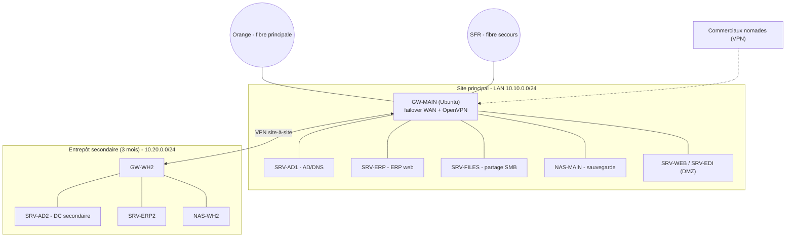

# MSPR AIRSOLID — dossier technique

Distributeur d'équipements aérauliques/climatisation, ~80 personnes, pas d'IT interne. Tout repose sur un **seul serveur physique de 2012** (AD + ERP web + partages fichiers), il n'y a aucune sauvegarde, et une **panne de 48 h** (coupure Internet) a déjà bloqué l'activité. La direction veut sortir de ce serveur unique et ne plus jamais perdre l'ERP 48 h.

Virtualisation : VirtualBox. Passerelles sous Ubuntu 24.04.

## Besoins et solutions

| Besoin (entretiens) | Solution |
|---|---|
| Sortir du serveur unique 2012 (à débrancher avant fin du mois) | Éclatement des rôles en VM séparées (AD, ERP, fichiers) puis décommissionnement |
| Plus jamais 48 h sans ERP (la panne venait d'une coupure Internet) | Double fibre (Orange + SFR) + box 5G Orange en secours |
| Aucune sauvegarde | Sauvegarde 3-2-1 avec Robocopy + copie hors-site |
| Continuité ERP et fichiers commerciaux | Partage SMB + NAS de sauvegarde |
| Accès des commerciaux nomades | VPN OpenVPN vers le partage SMB / l'ERP |
| Entrepôt secondaire dans 3 mois (8 postes, ERP sur place, synchro, 1 To) | VPN site-à-site + DC secondaire + réplication |
| Flux EDI du partenaire logistique | Passerelle SFTP isolée en DMZ |

RTO ERP demandé : 24 h.

## Architecture

### Plan d'adressage

Réseaux : Orange `203.0.113.0/24` (NAT `inet-op-a`), SFR `198.51.100.0/24` (NAT `inet-op-b`), 5G `192.0.2.0/24` (NAT `inet-5g`), LAN principal `10.10.0.0/24`, DMZ `172.16.10.0/24`, LAN entrepôt `10.20.0.0/24`, tunnel `10.99.0.0/24`, pool nomades `10.8.0.0/24`.

Hôtes principaux : GW-MAIN (10.10.0.254 + WAN Orange .11 / SFR .11), SRV-AD1 10.10.0.10, SRV-ERP 10.10.0.20, SRV-FILES 10.10.0.30, NAS-MAIN 10.10.0.35, SRV-WEB 172.16.10.10, SRV-EDI 172.16.10.20. Entrepôt : GW-WH2 10.20.0.254, SRV-AD2 10.20.0.10, SRV-ERP2 10.20.0.20, NAS-WH2 10.20.0.30, 8 postes 10.20.0.50-57.

## Maquette VirtualBox

VM (Ubuntu 24.04 sauf mention) : GW-MAIN, GW-WH2, SRV-ERP, SRV-WEB, SRV-EDI, SRV-ERP2 ; SRV-AD1/AD2 et SRV-FILES en Windows Server 2022 ; NAS-MAIN/WH2 en TrueNAS ou Ubuntu+Samba ; un poste Windows témoin par site. On ne lance pas tout en même temps, on démarre par groupe selon la démo.

Réseaux créés via `VBoxManage natnetwork add` (voir `scripts/provision-virtualbox.sh`). Deux NAT Networks distincts = deux opérateurs indépendants, ce qui permet de couper l'un sans l'autre.

Config réseau sous Ubuntu 24.04 = Netplan (`/etc/netplan/*.yaml`, `sudo netplan apply`, fichier en chmod 600). Exemple passerelle (double WAN par métriques) dans `configs/network/netplan-gw-main.yaml`.

## Éclatement du serveur unique

C'est la partie prioritaire (le vieux serveur doit partir avant la fin du mois). On migre rôle par rôle, sans coupure :

1. AD : promouvoir SRV-AD1 comme DC additionnel, vérifier la réplication (`repadmin /replsummary`), transférer les rôles FSMO, puis rétrograder l'ancien DC.
2. Fichiers : copier les partages avec `robocopy /MIR /COPYALL` (conserve les ACL), recréer les partages SMB, basculer les lecteurs réseau par GPO.
3. ERP : réinstaller l'application web + migrer sa base sur SRV-ERP, tester avec un groupe pilote, puis basculer.
4. Une fois tout validé, débrancher le serveur de 2012 (garder le disque quelques semaines au cas où).

Bénéfice : plus de point de défaillance unique, et l'AD devient redondé grâce au DC secondaire de l'entrepôt.

## Résilience Internet (Orange + SFR + 5G)

La panne de 48 h venait d'une coupure Internet, donc on rend le lien redondant. Deux prestataires ont été contactés : un chez **Orange** pour la fibre principale et la fourniture d'une **box 5G**, un chez **SFR** pour une fibre de secours sur un réseau opérateur indépendant.

La passerelle a plusieurs routes par défaut avec des métriques croissantes : fibre Orange (100), fibre SFR (200), 5G (300). Le noyau ne détecte pas seul une coupure côté opérateur, donc un watchdog (`scripts/wan-failover.sh`, lancé en service systemd) teste la connectivité de chaque lien et bascule sur le premier lien sain. La box 5G Orange sert de relais immédiat le temps de la bascule.

À noter : la fibre principale et la 5G viennent toutes les deux d'Orange, donc la vraie redondance opérateur repose sur la fibre SFR indépendante ; la 5G est surtout un relais de transition.

Côté VPN, les clients listent les deux IP publiques (Orange et SFR) pour que le tunnel remonte sur le lien encore actif.

Démo possible en maquette : couper le NIC WAN Orange (`VBoxManage controlvm GW-MAIN setlinkstate1 off`), le watchdog bascule la route par défaut sur SFR, Internet reste joignable. La bascule du VPN côté client depuis un seul hôte VirtualBox est plus difficile à montrer (deux opérateurs indépendants depuis le même poste) : elle est configurée mais pas simulée intégralement.

## Sauvegarde 3-2-1 (Robocopy)

3 copies, 2 supports, 1 hors-site : production, NAS local (Robocopy `/MIR` nocturne + snapshots), et copie vers le NAS de l'entrepôt (ou disque externe rotatif en attendant l'entrepôt). Script dans `configs/backup/backup-robocopy.ps1`, planifié en tâche quotidienne. La base ERP est dumpée avant le Robocopy ; l'AD est sauvegardé en System State.

Attention : `robocopy /MIR` réplique aussi les suppressions, donc ce sont les snapshots du NAS qui protègent contre un ransomware, pas le miroir. On teste les restaurations (un fichier mensuellement, la base ERP par trimestre) — c'est le maillon qui manquait.

## VPN nomades

On n'expose pas le SMB sur Internet (cible classique de ransomware). À la place, OpenVPN en road-warrior sur GW-MAIN, un certificat par commercial (révocable individuellement). Une fois connecté, le nomade accède à `\\SRV-FILES\Commerciaux` selon ses droits AD, et à l'ERP par son URL interne. Configs dans `configs/openvpn/`.

## Entrepôt secondaire (phase 2, 3 mois)

Tunnel OpenVPN site-à-site entre GW-WH2 et GW-MAIN. Un DC secondaire (SRV-AD2) réplique l'AD pour que l'authentification survive à une panne du site principal. L'ERP local (SRV-ERP2) est synchronisé via réplication de base de données ; les fichiers et les sauvegardes sont répliqués sur NAS-WH2 (1 To). La synchro initiale du 1 To peut se faire par disque transporté, puis seuls les deltas passent par le VPN. L'entrepôt sert aussi de site de secours pour le PRA.

## Flux EDI (phase 3)

Le partenaire logistique dépose ses fichiers en SFTP sur une passerelle isolée en DMZ (SRV-EDI), compte chrooté sans shell, authentification par clé, IP autorisées seulement (`configs/edi/sshd-edi.conf`). Un connecteur interne va chercher les fichiers et les ingère dans l'ERP après contrôle de format et antivirus. La DMZ ne peut pas initier de connexion vers le LAN, donc le partenaire n'atteint jamais l'ERP directement.

## PRA / PCA

RTO/RPO : ERP 24 h / 24 h, fichiers 4 h / 24 h, AD < 1 h grâce au DC secondaire, Internet < 1 min grâce à la bascule. Continuité assurée par la double fibre, la fin du serveur unique et le DC secondaire. Reprise : restauration depuis le NAS (snapshots / Robocopy), bascule sur l'entrepôt en cas de sinistre du site principal. Comme il n'y a pas d'IT interne, les procédures sont écrites pour pouvoir être suivies par un prestataire.

## Tests principaux

- Réplication AD saine et FSMO transférés avant de retirer l'ancien serveur.
- Bascule fibre Orange vers SFR : couper le WAN, vérifier que la route et Internet basculent.
- Sauvegarde Robocopy puis restauration d'un fichier (ACL conservées).
- VPN nomade : connexion, montage du partage SMB selon les droits, révocation d'un certificat.
- Tunnel site-à-site monté, authentification d'un poste entrepôt sur le DC secondaire.
- Cloisonnement DMZ : depuis SRV-EDI, un ping vers le LAN doit échouer.

## Contenu du dépôt

- `configs/network/` : Netplan double fibre, nftables, service watchdog
- `configs/openvpn/` : serveurs et clients (site-à-site + nomades), CCD
- `configs/backup/` : script Robocopy planifié
- `configs/smb/` : partages SRV-FILES
- `configs/edi/` : SFTP chrooté
- `scripts/` : provisioning VirtualBox, PKI, profils .ovpn, watchdog WAN

Les certificats et clés ne sont pas versionnés (voir `.gitignore`), ils se génèrent avec `scripts/init-pki.sh` et `scripts/make-ovpn.sh`.
